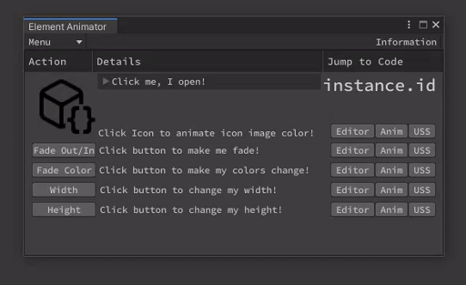
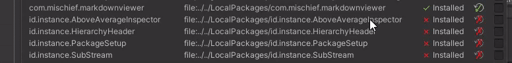
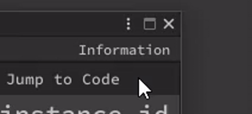
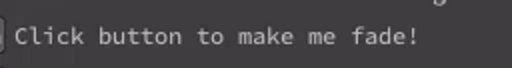
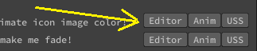
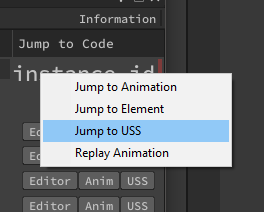

# ElementAnimationToolkit

### A collection of Unity UIToolkit/UIElements chainable animation extension methods, premade animated elements, and examples. <!-- omit in toc -->


<br>

- [ElementAnimationToolkit](#elementanimationtoolkit)
    - [Recent Features or Changes](#recent-features-or-changes)
  - [Documentation](#documentation)
    - [Installation](#installation)
      - [Install via OpenUPM](#install-via-openupm)
      - [Unity Package Manager](#unity-package-manager)
    - [Animations and Features](#animations-and-features)
    - [Usage / Examples](#usage--examples)
      - [Background Color Fade-In](#background-color-fade-in)
      - [Hover Border Pulse](#hover-border-pulse)
      - [Fade-in sequence](#fade-in-sequence)

<br>

### Recent Features or Changes
| New Animation types: |                       |
| -------------------- | --------------------- |
| Sequences            |                       |
|                      | ShowForDuration       |
| Base Annimations     |                       |
|                      | AnimateOpacityDelayed |

## [Documentation]("https://docs.instance.id/elementanimationtoolkit/")

---

### Note: UIElements Animations are listed as Experimental by Unity - API subject to change. Also, since Element Animation Toolkit is currently underactive development, it is possible for API changes in this library as well <!-- omit in toc -->

<br>

#### The intent of this package is to help asset developers more easily create their own animation sequences via code.<!-- omit in toc -->
Though, I have been adding some new "ready to go" UIElement types, such as the "AnimatedFoldout", which you just use as you would a a typical foldout comes animated with no additional coding, minus some exposed properties to adjust the animation to your liking. I do intend to add more of these as I go along.

<br>

This package began simply as a small collection of helpers methods I created across my last few projects to make animating editor elements much easier and finally put into a single place. I continue to add to it as I go along but decided to put together several examples and wanted to share them.

<br>

### Installation

---

#### [Install via OpenUPM](https://openupm.com/packages/id.instance.elementanimationtoolkit)
```openupm add id.instance.elementanimationtoolkit```

#### [Unity Package Manager](https://github.com/instance-id/ElementAnimationToolkit/tree/upm)
```github.com/instance-id/elementanimationtoolkit.git#upm```

<br>

### Animations and Features

---

(There are more, I just have not added them all yet) 

| Animation types:   | Method                 |
| ------------------ | ---------------------- |
| Sequences:         |                        |
|                    | AnimCharacterSequence  |
|                    | AnimFadeInSequence     |
|                    | ShowForDuration        |
| Continuous:        |                        |
|                    | AnimBorderPulse        |
| Hover:             |                        |
|                    | HoverBorderPulse       |
| Base Annimations:  |                        |
|                    | AnimateBackgroundColor |
|                    | AnimateBorderColor     |
|                    | AnimateColor           |
|                    | AnimateImageTintColor  |
|                    | AnimateOpacity         |
|                    | AnimateOpacityDelayed  |
|                    | AnimateWidth           |
|                    | AnimateHeight          |
| Extensions/Helpers |                        |
|                    | AutoToggleAfter        |
|                    | ApplyPrivacyMask       |
|                    | SetDisplay             |
|                    | GetDisplay             |
|                    | SetOpacity             |
|                    | GetDisplay             |
|                    | SetText                |
|                    | OpenURL                |

### Usage / Examples:

Examples: Tools > instance.id > Element Animation Toolkit

Note: The code is pretty ~~heavily~~ excessively documented and currently most method summaries for extension methods have examples in them. Be sure to check the comments for additional details!


<details>
<summary>Example: Method IDE summary for 'HoverColor()'</summary>

```cs
/// <summary>
/// Adds forecolor hover capability that will not be lost like CSS:hover when programatically setting background color
/// </summary>
/// <example>
/// <code>
/// var originalColor = GetColor.FromHex("#BABABA");
/// var hoverColor = GetColor.FromHex("#2F569C");
///
/// label.HoverColor(originalColor, hoverColor);
/// </code>
/// </example>
```
</details>

There are several fairly basic base animation helper methods which can easily be used on their own, but are also the basis of the more complex animation sequences:

#### Background Color Fade-In

(The initial fade from gray to blue)

<details>
<summary>Example animation base helper: AnimateBackgroundColor()</summary>
Usage:

```c#

Color originalColor = GetColor.FromHex("#BABABA");
Color fadeColor = GetColor.FromHex("#2F569C");
var durationOfFade = 250; // In milliseconds

VisualElement visualElement = new VisualElement();
visualElement.AnimateBackgroundColor(originalColor, fadeColor, durationOfFade);

```

</details>

---

#### Hover Border Pulse

<details>
<summary>Example hover animation: HoverBorderPulse()</summary>

Usage:

```c#
VisualElement visualElement = new VisualElement();
visualElement.HoverBorderPulse(pulseStartColor: GetColor.FromHex("#7F3B3A"), pulseEndColor: GetColor.FromHex("#2F569C"), colorDuration: 500);
```

</details>

---

#### Fade-in sequence


<details>
<summary>Example complex animation sequence: AnimFadeInSequence()</summary>

Usage:

```c#
Label label = new Label {text = "Click button to make me fade!"};

const int fadeInTime = 500;
const float displayTime = 2000f;
const int fadeOutTime = 500;
string newText = "then back to the original!";
var originalTextColor = GetColor.FromHex("#BABABA");
var animatedTextColor = GetColor.FromHex("#607FAE");

label.AnimFadeInSequence(newText, animatedTextColor, originalTextColor, fadeInTime, displayTime, fadeOutTime);
```

</details>

Then, of course, there is everything in between.

Additionally there are many helper methods relating to many different Types from Color to opening weblinks in the browser.

<details>
<summary>Example color helper method: GetColor.FromHex()</summary>

Usage:
```cs
Color color = GetColor.FromHex("#CCCCCC");
```

Implementation:

```cs
public static Color FromHex(this string color)
{
    if (!color.StartsWith("#")) Debug.LogWarning("The FromHex() function must be used on a hexadecimal string beginning with #");
    ColorUtility.TryParseHtmlString(color, out var outColor);
    return outColor;
}
```

</details>

<details>
<summary>Example creating an external url link : OpenURL() </summary>

Usage:
```cs
VisualElement visualElement = new VisualElement();
visualElement.OpenURL("https://github.com/instance-id/ElementAnimationToolkit");
```

Implementation:

```cs
public static T OpenURL<T>(this T element, string url) where T : VisualElement
{
    element.RegisterCallback<MouseUpEvent>(evt =>
    {
        if (evt.button == 0)
        {
            Application.OpenURL(url);
            evt.StopPropagation();
        }
    });

    return element;
}
```

</details>

Important files:

    Assets/instance.id/ElementAnimationToolkit/Editor/EATKEditor.cs
This file is the primary example and demonstrative reference for most major features and is the main editor window of the package
where you can view examples of several different types of animations and their usage.

You can access the main editor window via Tools > instance.id > Element Animation Toolkit

There are three buttons per row, Editor, Anim, and USS.



The editor button will take you directly to the editor code specific to that element where you will see the C# implementation of UIElements as well as most callback registrations.

The Anim button takes you to another section of the file in which you can see the declaration, setup, and execution of any animation specific functions,

Lastly is the USS button, which takes you to the USS stylesheet and the location of the particular animation if you need.

The animations without a row of buttons have a right-click context menu implemented which has similar options to jump directly into
the code at the proper location for the animation. (The methods I have created for jumping straight to the proper lines of code
are of course included and you are welcome to take advantage of them for your own needs.)



---

